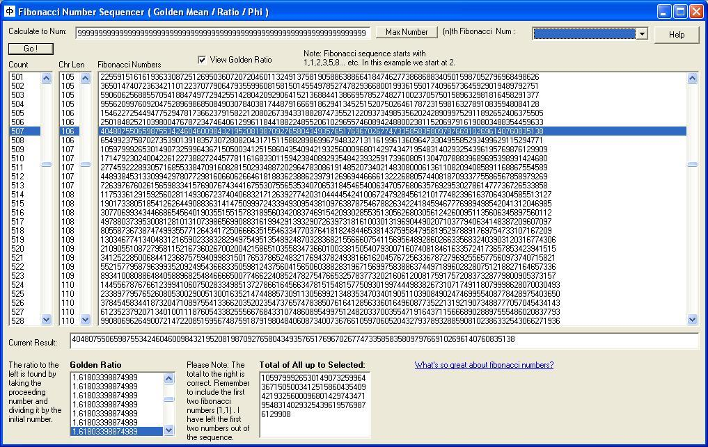



## Golden Mean \( Fibonacci Sequencer \)

### Description

Golden Mean Fibonacci Sequencer

This program will sequence up to the 1,476th Fibonacci number (309 digits long). These super long numbers avoid exponent display ( E+ num ) and rather spell out the value. It shows the Golden Ratio for each number and explains in the code exactly how to come up with it. The Golden Ratio is an extremely interesting number as it appears in many things in nature such as pinecones, seashells, body parts, dna, reproduction of bees, hurricanes, birth of universes and much more! The mysterious number Phi has been found in many ancient architectures and even in paintings by Leonardo Da Vinci. The numbers were also used to create beautiful musical compositions. This is definitely something worth exploring.
 
### More Info
 

             |
---                |---
**Submitted On**   |2004-11-11 01:11:00
**By**             |[Dreamcoding](https://github.com/Planet-Source-Code/PSCIndex/blob/master/ByAuthor/dreamcoding.md)
**Level**          |Beginner
**User Rating**    |5.0 (20 globes from 4 users)
**Compatibility**  |VB 4\.0 \(16\-bit\), VB 4\.0 \(32\-bit\), VB 5\.0, VB 6\.0
**Category**       |[Math/ Dates](https://github.com/Planet-Source-Code/PSCIndex/blob/master/ByCategory/math-dates__1-37.md)
**World**          |[Visual Basic](https://github.com/Planet-Source-Code/PSCIndex/blob/master/ByWorld/visual-basic.md)
**Archive File**   |[Golden\_Mea18170611112004\.zip](https://github.com/Planet-Source-Code/dreamcoding-golden-mean-fibonacci-sequencer__1-57196/archive/master.zip)

